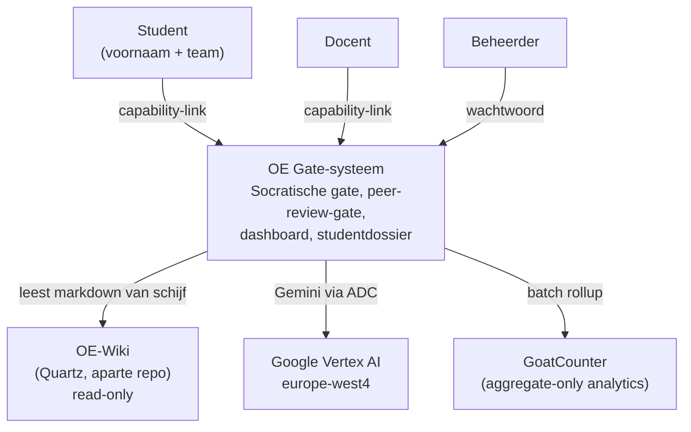
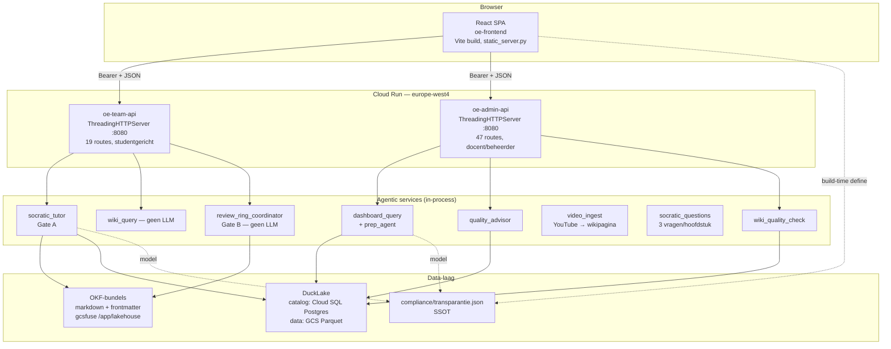
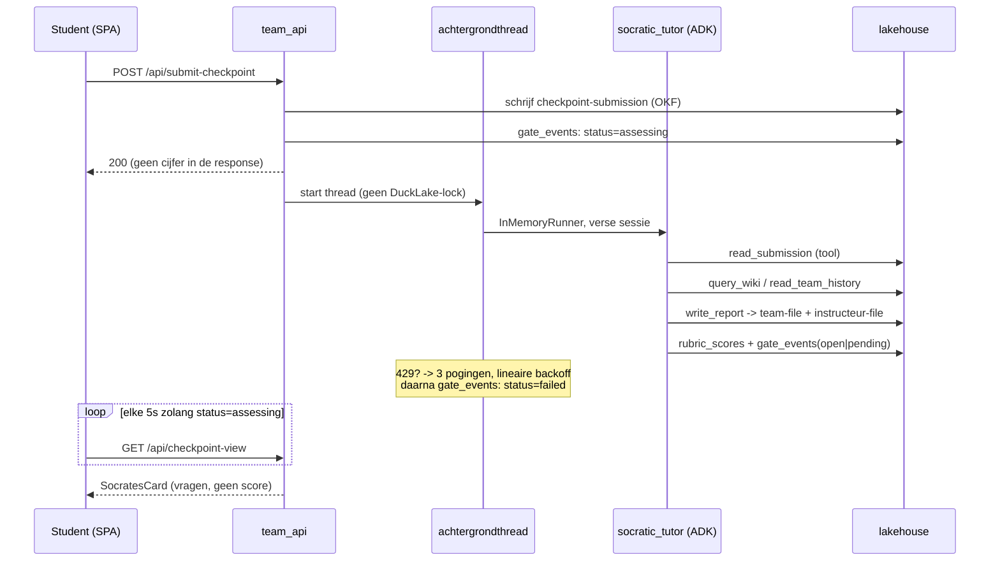
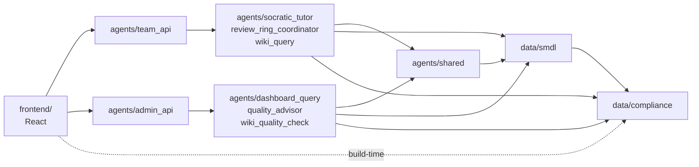
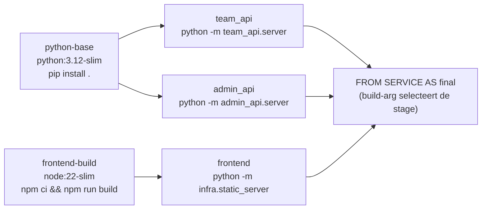

# Project Architecture Blueprint — Operational Excellence Gate-systeem

> **Gegenereerd:** 17 juli 2026, tegen `oe-gate-system` @ `main` (227 getrackte bestanden) en deze documentatierepository @ `77a3bc1`.
>
> **Wat dit document is:** een beschrijving van de architectuur **zoals die daadwerkelijk in de code staat**, bedoeld als referentie om architecturale consistentie te bewaren bij nieuw werk. Het is afgeleid van de code, niet van het ontwerp.
>
> **Wat het niet is:** een vervanging van het LRD (wat & waarom), het TDD (hoe het bedoeld is) of het buildplan (voortgang). Waar dit document afwijkt van het TDD, is dat een **bevinding**, geen correctie — zie [Deel 15](#15-drift-waar-code-en-tdd-uiteenlopen).
>
> **Onderhoud:** regenereer dit document na elke golf uit het buildplan waarin een nieuwe laag, agent of cross-cutting mechanisme is toegevoegd. Het is een momentopname, geen levend contract; de guard-tests uit [Deel 13](#13-architecture-governance) zijn dat wel.

---

## 0. Waar de code leeft

Dit is het eerste dat een nieuwe ontwikkelaar moet weten en het is niet af te leiden uit één repository:

| Repository | Inhoud | Status |
|---|---|---|
| `operational-excellence-course` (deze) | LRD, TDD, buildplan, OKF-SPEC, test-data, frontend-mockups | Documentatie; **geen code** |
| `oe-gate-system` | data-laag, agentic-services-laag, frontend, infra | **De implementatie** |
| `oe-wiki` (fork van `wiki-template`) | boekconcepten, bedrijfscases, gepubliceerde content | Wordt **gebruikt**, niet gewijzigd (NFR-02) |

De splitsing is een architectuurbeslissing, geen historisch ongeluk. NFR-02 eist minimale nieuwe infrastructuur; de wiki blijft daarom in haar eigen Quartz-fork en het gate-systeem leest haar bestanden read-only van schijf. Het buildplan woont in de documentatierepository omdat het de gedeelde bron van waarheid is voor voortgang over beide repo's heen (`oe-gate-system/README.md:28`: *"vink daar taken af, niet hier"*).

---

## 1. Architectuurdetectie en -analyse

### 1.1 Technologiestack (auto-gedetecteerd)

| Laag | Stack | Bewijs |
|---|---|---|
| Data | Python 3.11+, DuckDB/DuckLake, pydantic 2, pandas, PyYAML | `pyproject.toml:5-25` |
| Agentic services | Google ADK 2.4 (`google-adk[a2a,db,eval]~=2.0`), stdlib `ThreadingHTTPServer` | `pyproject.toml:7`, `agents/team_api/server.py:42` |
| Frontend | React 19, Vite 8, TypeScript 6, react-router-dom 7 | `frontend/package.json` |
| Deployment | Docker (multi-stage), Cloud Run, Cloud SQL Postgres, GCS + gcsfuse, `europe-west4` | `infra/Dockerfile`, `infra/cloudrun.yaml` |
| CI | GitHub Actions + Workload Identity Federation | `.github/workflows/deploy-gate-system.yml` |
| Test | pytest 8 + pytest-asyncio, Playwright 1.61 | `pyproject.toml:29-41`, `playwright.config.ts` |

**Wat opvalt door afwezigheid** — en dat is telkens een gedocumenteerde keuze, geen omissie:

- **Geen FastAPI, geen uvicorn, geen Starlette.** Beide HTTP-servers zijn stdlib `ThreadingHTTPServer` + `BaseHTTPRequestHandler` met een dict-routetabel. KISS (LRD Deel 5.1), expliciet vastgelegd in `agents/team_api/server.py:6-8`.
- **Geen ORM, geen migratieframework.** Ruwe DuckDB-SQL achter een functie-façade.
- **Geen state-managementbibliotheek, geen data-fetchingbibliotheek, geen UI-kit in de frontend.** Alleen `useState` en een handgeschreven `request<T>()`.
- **Geen unit-testrunner in de frontend.** Alleen `tsc -b` en `oxlint`; alle frontendverificatie loopt via Playwright.
- **Geen `GOOGLE_MODEL`-env-var.** Bewust verwijderd (Main Task 30) en met een test bewaakt — zie [Deel 7.5](#75-configuratiemanagement).

### 1.2 Architectuurpatroon

Het systeem is **een gelaagd monoliet-in-drieën, gedeployed als drie Cloud Run-services**, met twee patronen die het gedrag echt bepalen:

1. **Schema-afdwinging boven instructie.** Waar het TDD een garantie eist (geen cijfer zichtbaar, nooit cijfers verzinnen, traceerbaarheid), is die geïmplementeerd als een pydantic-schema met `extra="forbid"` zonder veld waar de verboden waarde in zou passen — niet als een regel in een prompt. Een LLM kan een instructie negeren; hij kan geen `ValidationError` wegpraten.
2. **Guard-tests als architectuurmechanisme.** De single sources of truth (modelnamen, weeknummers, runtime-datafiles, regio) worden bewaakt door tests die de échte boom scannen en CI rood maken. Het projectgeheugen hierover is expliciet: de vorige SSOT (`agents/shared/models.py`) stond in een docstring en was **stil onwaar — 2 van de 9 call sites hielden zich eraan** (`agents/tests/test_transparantie_ssot.py:8-12`).

De afhankelijkheidsrichting is strikt eenrichtings: `frontend → agents → data`. Niets onder `data/` importeert `agents` — `data/compliance/__init__.py:33-38` legt uit dat de compliance-SSOT dáárom in `data/` woont en niet in `agents/shared/`.

### 1.3 Leidende principes, zoals afleesbaar uit de code

| Principe | Hoe je het herkent |
|---|---|
| Privacy by design | Uitsluitend `first_name`, `team_id`, `klas_id`, `cohort`. Geen studentnummer, e-mail of achternaam in enig schema |
| Never invents | Elk cijfer, duplicaatoordeel en aandachtspunt is herleidbaar tot een `source_ref` die naar een echte DuckLake-snapshot wijst |
| Fail closed | Nieuwe routes zijn authenticated tenzij iemand ze zichtbaar op een allowlist zet; onbekend team → weigeren |
| Eerlijk over wat niet werkt | Code documenteert open gaten (`test.fail()` in plaats van `skip`, `subject_id`-collisie beschreven én niet gesloten) |
| De les staat bij de fix | Vrijwel elke niet-triviale docstring noemt de productiefout waarvoor hij geschreven is |

---

## 2. Architectuuroverzicht (C4)

### 2.1 Niveau 1 — Context



### 2.2 Niveau 2 — Containers



De pijl die het meeste verklaart is de gestippelde: **dezelfde JSON configureert de agents én wordt in de onboarding aan studenten getoond**. Een model kan niet veranderen zonder dat de tekst die studenten lezen in dezelfde commit verandert.

### 2.3 Niveau 3 — De gate-flow (dataflow)



Twee dingen in dit diagram zijn architectureel, niet incidenteel:

- **De kickoff-boodschap bevat de inzendingstekst niet.** De agent moet `read_submission` aanroepen. Een gekopieerde tekst zou van het lakehouse kunnen afdrijven en de `@log_action`-trail overslaan (`agents/team_api/service.py:483-489`).
- **Na afloop verifieert de server het lakehouse, niet de agent.** `run_socratic_tutor_for_checkpoint` eist dat `write_report` én `read_submission` in de tool-calls voorkomen en gooit anders `RuntimeError` — *"an LLM can end its turn having written nothing; reporting 'done' on the strength of a cheerful final message is exactly the never-invents failure TDD 4.4 forbids"* (`service.py:539-553`).

---

## 3. Kerncomponenten

### 3.1 Data-laag — `data/`

**Verantwoordelijkheid:** alle persistente staat, in twee vormen die elk hun eigen reden hebben.

| Vorm | Wat | Waarom deze vorm |
|---|---|---|
| OKF-bundel (markdown + YAML-frontmatter) | inzendingen, gate-events, rosters, escrow, sessies | Mens-leesbaar, diffbaar, `git`-baar; FR-09-historie-export is letterlijk het bestand |
| DuckLake-tabellen (Parquet + catalog) | 16 tabellen voor aggregatie, audit en credentials | Snapshot-versionering geeft gratis citeerbaarheid |

**Interne structuur.** `data/smdl/` is een *quarantainegrens*: `ducklake.py` (1096 regels) is de enige module die DuckLake-SQL kent. Callers gebruiken `write_x`/`query_x`-paren; niemand schrijft ooit zelf een `ATTACH`- of `AT (VERSION => n)`-string.

Het idioom, ontdaan van ruis (`data/smdl/ducklake.py:271-285, 365-370`):

```python
def append_rows(conn, table: str, df: pd.DataFrame) -> int:
    conn.register("df_view", df)
    conn.execute("BEGIN")
    conn.execute(f'CREATE TABLE IF NOT EXISTS lake."{table}" AS SELECT * FROM df_view WHERE 0 = 1')
    conn.execute(f'INSERT INTO lake."{table}" SELECT * FROM df_view')
    conn.execute("COMMIT")
    conn.unregister("df_view")
    return latest_snapshot(conn, table)

def write_gate_event(conn, row: GateEventRow) -> int:
    return append_rows(conn, "gate_events", pd.DataFrame([row.model_dump()]))
```

**Er is geen migratieframework.** De consequentie is precies gedocumenteerd (`ducklake.py:355-359`): een `Literal` verbreden is gratis (kolommen zijn in de catalog gewoon strings), maar **een kolom toevoegen breekt schrijfacties tegen een bestaand lakehouse**, omdat de `INSERT` positioneel is. Dit is de reden dat de admin-sessie-vervaltijd wordt *afgeleid* uit `created_at` in plaats van opgeslagen in een `expires_at`-kolom (`shared/identity.py:171-192`). Wie een kolom wil toevoegen, moet dat weten vóórdat hij begint.

**Vijf lakehouse-tiers** (`data/smdl/storage.py:69-188`), elk een eigen namespace, catalog en Parquet-pad:

| Tier | Namespace | Inhoud |
|---|---|---|
| team | `<cohort>-team-<id>` | inzendingen, gate-events, escrow, wiki-kwaliteit |
| ring | `<cohort>-ring-<id>` | instructeur-documenten |
| klas | `<cohort>-klas-<id>` | rosters, assessmentplanning, sessies |
| admin | `<cohort>-admin` | cursusperiode, `access_grants`, `admin_accounts`, `docenten` |
| system | `_system` (cohort-onafhankelijk) | `action_log` |

Isolatie tussen scopes is **structureel via het bestandssysteem**, niet via een `WHERE`-clausule: elke scope is een ander lakehouse met een eigen catalog. `storage.py:23-26`: *"nothing in this module ever opens more than one lakehouse namespace at a time."*

De scope `iedereen` bestaat bewust **niet** in de data-laag. `route_instructor_document` gooit een `ValueError` met een verwijzing naar het git-commitpad van de wiki (`data/smdl/service.py:65-69`) — en die check bestaat ondanks de `Literal`-typehint, omdat een HTTP-body op runtime `"everyone"` kan bevatten.

### 3.2 Agentic-services-laag — `agents/`

Drie soorten module, en het onderscheid is bewust:

| Soort | Packages | Heeft een `Agent`? |
|---|---|---|
| LLM-agents | `socratic_tutor`, `dashboard_query`, `wiki_quality_check`, `quality_advisor`, `video_ingest`, `socratic_questions` | ja |
| Deterministische orkestratie | `review_ring_coordinator` (ADK `Workflow`, geen LLM-node), `wiki_query` (geen LLM) | nee |
| HTTP-adapters | `team_api`, `admin_api` | nee — zij *roepen* agents aan |
| Cross-cutting | `shared/` (`session`, `identity`, `action_log`) | n.v.t. |

**Het constructie-idioom** (`agents/socratic_tutor/agent.py:34-77`) — model uit de SSOT, instructie van schijf, tools op de task-worker, chat-coördinator erboven:

```python
from google.adk import Agent
from compliance import model_for
from .tools import query_wiki, read_submission, read_team_history, write_report

_PROMPTS_DIR = Path(__file__).parent / "prompts"
WORKER_INSTRUCTION = (_PROMPTS_DIR / "system_instruction.md").read_text(encoding="utf-8")

socratic_tutor_worker = Agent(
    name="socratic_tutor_worker",
    model=model_for("socratische_tutor"),
    mode="task",
    instruction=WORKER_INSTRUCTION,
    tools=[read_submission, query_wiki, read_team_history, write_report],
)

root_agent = Agent(
    name="socratic_tutor",
    model=model_for("socratische_tutor"),
    sub_agents=[socratic_tutor_worker],
    instruction="You are the entry point... Delegate every incoming checkpoint submission to "
                "`socratic_tutor_worker` immediately — you never generate Socratic questions "
                "or a rubric score yourself...",
)
```

De twee lagen zijn **geen stijl**: ADK 2.4 gooit `ValueError: LlmAgent as root agent must have mode='chat', but got mode='task'` (`agent.py:10-18`). Tools zijn gewone Python-functies; ADK's automatic function calling leest de typehints en docstrings. Er is nergens een `FunctionTool(...)`-wrapper.

Dat `(_PROMPTS_DIR / "system_instruction.md").read_text()` op **importtijd** gebeurt, is de reden dat `pyproject.toml:52` een `package-data`-regel heeft: zonder die regel laadt de module niet in de container. Dat is niet theoretisch — het is hoe het gevonden is (Main Task 7.6, een live smoke-test).

**Waar "never invents" wordt afgedwongen** — zes plaatsen, geen daarvan een prompt-instructie:

1. `_derive_gate_status(rubric_score)` (`socratic_tutor/tools.py:113-118`) — `write_report` accepteert `gate_a_status` als argument, maar wat *opgeslagen* wordt is altijd herberekend tegen `RUBRIC_PASS_THRESHOLD = 70.0`. De claim van de LLM komt terug als `gate_a_status_llm_claim`: zichtbaar, nooit stil weggegooid.
2. Twee gescheiden schema's met `extra="forbid"` (`socratic_tutor/schemas.py:33-67`) — `TeamFacingReport` heeft geen veld waar een score in past.
3. De returnwaarde van `write_report` laat `rubric_score` weg, zodat de score niet terug de conversatiecontext in kan (`tools.py:409-412`).
4. `scan_for_scoring_language` (`socratic_tutor/testing.py:101-116`) — 16 woordgrens-regexes, NL+EN, **live gedraaid op elk echt rapport** (`team_api/service.py:562-564`). Woordgrenzen zijn dragend: de oude substring-check verwierp "passagiers" en "toepassing".
5. Lakehouse-verificatie boven agent-say-so (hierboven, §2.3).
6. `_filter_valid_points` (`dashboard_query/prep_agent.py:692-718`) — schrapt onvoorwaardelijk elk `PrepPoint` waarvan de `source_ref` geen echt event benoemt. Verplicht-en-niet-leeg bewijst *aanwezigheid*; dit bewijst *echtheid*. Niet uit te zetten.

Plus de structurele variant in `build_cohort_positions` (`dashboard_query/agent.py:355-388`): de query die zou kunnen lekken **wordt niet gedraaid**. `TeamPositionRow` heeft exact twee velden en `extra="forbid"`.

#### De video-pijplijn — `video_ingest` + `socratic_questions`

Twee agents, bewust gescheiden, achter één docentscherm (*Video naar wiki*). De
docent plakt een YouTube-URL en vinkt **maximaal vijf** hoofdstukken aan;
daarna draait de pijplijn op een achtergrondthread — fetchen plus drie
modelstadia loopt tot tientallen seconden, ruim voorbij het request-plafond in
`infra/cloudrun.yaml`.

| Stap | Module | Wat er gebeurt |
|---|---|---|
| 1 | `video_ingest` | transcript ophalen en eruit de samenvatting schrijven |
| 2 | `socratic_questions` | per hoofdstuk drie vragen, verankerd in de conceptpagina's |
| 3 | `wiki_quality_check.propose_links` | linksuggesties naar bestaande pagina's |
| 4 | `video_ingest.pipeline.publish_draft` | schrijft de pagina én de entity-pagina's in de wiki-checkout |

De pagina die eruit komt is `type: video-bron` — het enige paginatype dat dit
systeem zelf aanmaakt in plaats van leest — en landt in `wiki/sources/`, dat
al in `scan_wiki`'s globs stond.

**Het transcript is bron, geen sectie.** De agent leest het nauwkeurig en
publiceert het niet: de eerste pagina die deze pijplijn opleverde was 211
regels, waarvan het leeuwendeel een transcript dat niemand leest en dat tussen
de student en de twee dingen stond waarvoor die kwam. Wat ervoor in de plaats
komt is een korte lijst tijdstempel-ankers — dat wás de functie van dat
transcript: springen naar de passage waar een vraag over gaat. De pagina ging
daarmee naar 41 regels.

Zeven dingen die dragend zijn:

- **Stap 4 commit niet.** `publish_draft` schrijft het bestand en meldt
  `WRITTEN_NOT_COMMITTED`; een cross-repo commit vereist een deploy key die
  deze service niet heeft. De docent ziet "geschreven naar *pad*, nog niet
  gecommit" — één duidelijk gemarkeerd gat in plaats van een onzichtbaar.
- **Twee agents, geen uitbreiding van `socratic_tutor`.** Die praat met één team
  over hún inzending; zijn tools (`read_submission`) betekenen niets voor een
  video. Wat geërfd wordt is de pedagogie — nooit een oordeel, nooit het
  antwoord — en die staat opnieuw in de eigen prompt, zodat de twee evalsets
  onafhankelijk kunnen bewegen.
- **Drie vragen per hoofdstuk, op Understand / Analyze / Evaluate** (Anderson &
  Krathwohl). Niet zes niveaus: *Remember* is te beantwoorden door omhoog te
  scrollen, *Apply* vraagt een procedure die dit materiaal niet levert, en
  *Create* is wat het checkpoint zelf al eist. De prompt draagt per niveau de
  werkwoordenlijsten, want het werkwoord maakt het niveau zichtbaar zonder het
  te benoemen. `grade` en `score` staan in de bron onder *Evaluate* maar zijn
  hier verboden: dit systeem velt nooit een oordeel.
- **De output is Nederlands**, ongeacht de taal van de video. Zonder die regel
  volgde de agent de taal die in de invoer domineerde, en leverde dezelfde
  video de ene run Nederlandse en de volgende Engelse vragen. Vier dingen
  blijven onvertaald: de `**Video title:**`-regel (een citaat), eigennamen en
  functietitels, vaktermen die de cursus zelf in het Engels gebruikt
  (`Kaizen`, `Jidoka`, `lean`), en directe citaten van de spreker.
- **Eén pagina per run, afgedwongen na afloop.** `_run_agent` plakt de tekst
  van *elk* event aaneen — de enige reden dat het werk van de worker
  überhaupt aankomt, want de coördinator relayt niet betrouwbaar. De prijs is
  dat alles wat er verder gezegd wordt in dezelfde string belandt, en dat
  gebeurde: de eerste gepubliceerde pagina bevatte zichzelf twee keer, de
  tweede keer achter "Here is the output:" in een codeblok. Quartz parste de
  eerste frontmatter en rendeerde de tweede als letterlijke YAML — de
  renderfout die een docent zag en de duplicatie eronder waren één bug.
  `tools.take_first_page` knipt sindsdien bij de eerste code fence of het
  tweede frontmatter-blok; beide betekenen dat het model gestopt is met
  schrijven en begonnen met vertellen.
- **Een foutrapport is geen pagina.** Als `fetch_video` faalt hóórt de agent
  dat te melden in plaats van een transcript te verzinnen, en dat doet hij.
  Maar de pijplijn zette zo'n concept op `ready` met een leeg `error`-veld:
  publiceerbaar, één klik van een alinea proza in de wiki, en stap 2 schreef
  er ook nog vijftien vragen bij over een video die niemand had kunnen lezen.
  `run_pipeline` eist nu dat de pagina met frontmatter begint; anders gaat het
  concept naar `failed` met de reden van de agent erin.
- **De thumbnail wordt kant-en-klaar aangeleverd.** `build_frontmatter` geeft
  `thumbnail_markdown` terug — een afbeelding binnen een link, zodat het beeld
  toont en erop klikken de video opent — en de prompt zegt die letterlijk over
  te nemen. Hetzelfde patroon als de hoofdstukkoppen van `read_chapters`, en
  om dezelfde reden: beschrijven hóé je een markdown-constructie bouwt levert
  hem verkeerd gebouwd op. De eerste pagina zette de thumbnail als kale URL in
  een opsomming, waar Quartz een link van maakte. Een concept van vóór die
  wijziging draagt die kale vorm nog, dus `publish_draft` haalt elke pagina
  langs `with_thumbnail_image` — anders draait een herpublicatie een met de
  hand aangebrachte correctie stilzwijgend terug, wat één keer is gebeurd.

#### Wat de gepubliceerde pagina met de wiki verbindt

Vier dingen die alle vier ontbraken tot een docent opmerkte dat de graph leeg
bleef en de ToyotaGPT-pagina geen enkele relatie toonde met de Toyota-case
ernaast.

- **De links.** `propose_links` vond ze, het reviewscherm liet de docent er
  wegstrepen, en `full_page` plakte vervolgens alleen pagina en vragen aaneen
  — de gecureerde lijst ging bij publicatie de prullenbak in. Er staat nu een
  `## Zie ook`-sectie tussen samenvatting en vragen.
- **Geen zelfverwijzing.** Een herpublicatie vindt de vorige versie op ~0,85
  inhoudelijke gelijkenis; het *is* dezelfde inhoud. Filteren op bestandsnaam
  faalt, want een gepubliceerde pagina houdt de naam die ze ooit kreeg terwijl
  `slug_for` de huidige titel volgt — hier `building-toyotagpt-...` tegenover
  `toyotagpt-bouwen-...`. Vergeleken wordt daarom `source_url`.
- **Twee roots, één juiste.** De paden in `links` komen uit
  `scan_wiki(default_wiki_root())` (`OE_WIKI_ROOT`), terwijl `publish_draft`
  schrijft onder `wiki_repo_root()` (`OE_WIKI_REPO`). Die twee wijzen standaard
  naar dezelfde plek maar hoeven dat niet te blijven doen; resolveren tegen de
  verkeerde laat élke link in de "buiten de wiki"-tak vallen en zonder een
  woord verdwijnen. Gevonden door een proefpublicatie naar een tijdelijke map.
- **De entity-pagina's.** De wiki had er nul, dus er was niets om naartoe te
  linken. De sprekersregel staat al op de pagina mét functie en organisatie en
  wordt deterministisch ontleed — een tweede modelaanroep zou het oneens
  kunnen zijn met de pagina die hij beschrijft. Per spreker en per organisatie
  één pagina onder `wiki/entities/`, met relaties in beide richtingen
  (`authored-by`, `published-by`, `employs`, `part-of`, vocabulaire van de
  `relationships-panel`-extensie). Bestaande entity-pagina's worden nooit
  overschreven: daar kan een mens proza op hebben gezet.

De bestandsnamen van entity-pagina's behouden hun hoofdletters
(`Kordel-France.md`) en gaan **niet** door `sanitise_slug`: de relaties
verwijzen met hoofdletters, dus kleinletters zouden elke kant in de graph laten
bungelen.

Een entity is een knooppunt, geen lesstof, en dat heeft twee gevolgen die de
eerste publicatie meteen aan het licht bracht. Ze dragen **geen `stage`** —
`test_wiki_no_week_numbers` eist die van elke pagina zodat de portaaltab hem
kan plaatsen, en een entity wordt niet geplaatst maar naartoe gelinkt; er een
fase op plakken zou "Toyota" in de leeslijst van een fase duwen. En ze vallen
buiten `_relevant`, dus buiten beide contextuele secties — precies zoals de
`ai-wiki-contentmap`-verwijzingen. In `all_pages` staan ze wél: die lijst is
bewust nooit ingeperkt.

#### Hoe nieuw materiaal bij een student terechtkomt

Drie routes, en ze werken onafhankelijk van elkaar. `build_wiki_context`
(`wiki_query/agent.py`) bouwt ze; de Quartz-wiki kan dit niet, want die is
statisch en weet niet wie er leest.

| Sectie | Match op | Gevoed door |
|---|---|---|
| Bij jullie checkpoint | het hoofdstuk van hún eigen inzending, tegen de hoofdstuktags van de pagina | `CheckpointSubmission` |
| Bij jullie fase | de fase van het team, tegen `stage` **of** de fase van een hoofdstuktag | `wiki_index.stages_touched` |
| Alle pagina's | niets — nooit ingeperkt door de twee secties hierboven | `scan_wiki` |

Die tweede regel — `stage` **of** een hoofdstuktag — is nieuw, en de reden is
de video-pijplijn. Een pagina draagt precies één `stage`, en
`build_frontmatter` moet dus kiezen als een video vijf hoofdstukken beslaat;
het kiest de laatste fase die hij raakt. De eerste gepubliceerde video was
getagd ch03, ch04, ch08, ch15 en ch16 en kreeg daarmee `develop`. Een
Design-team dat op Ch8 zat kon hem alleen bereiken door de volledige lijst van
67 kaarten door te scrollen — precies het platte lijstje dat deze tab vervangt.

Matchen op de hoofdstuktags lost dat op zonder het frontmatter-contract van de
wiki te raken. Gemeten tegen de echte wiki bij die wijziging: **vijf pagina's
wonnen een fase, geen enkele verloor er een.** Vier daarvan zijn bedrijfscases
— Toyota bij Direct, Amazon bij Deliver, IKEA bij Develop — die altijd al
hoofdstuktags uit die fase droegen terwijl hun `stage` iets anders zei.

`STAGE_BY_CHAPTER` (LRD Deel 8; de week-landingspagina's van de wiki zeggen
hetzelfde) woont in `wiki_quality_check.wiki_index`, niet in `video_ingest`
waar hij begon. Twee kopieën zouden de `stage` van een pagina en het idee dat
de browser van die fase heeft stilletjes uit elkaar laten lopen.

`read_chapters` en het docentscherm delen één opzoekfunctie
(`wiki_quality_check.wiki_index.chapter_pages`), die alleen `type:
boek-concept`-pagina's teruggeeft: een hoofdstuktag is niet uniek — de 23
Lean-tool-pagina's dragen er ook een — en zonder dat filter verwijst een vraag
over Hoofdstuk 16 naar "Kanban boards".

### 3.3 HTTP-oppervlak

Beide servers: stdlib, dict-routetabel `(method, path) → handler`, dunne handlers die JSON-bare waarden teruggeven.

| Server | Poort (dev) | Routes | Publiek |
|---|---|---|---|
| `team_api` | 8801 | 19 (`server.py:413-438`) | studenten |
| `admin_api` | 8799 | 47 (methode+pad), verdeeld over 4 tabellen (`ROUTES`, `IDENTITY_ROUTES`, `BINARY_ROUTES`, `HTML_ROUTES`) | docenten, beheerders |

Vier tabellen in `admin_api` in plaats van één, omdat de responsetypes verschillen: JSON, een PDF (`application/pdf`, ruwe bytes), HTML (de printbare toegangssheet), en handlers die de opgeloste `Identity` nodig hebben.

**`_DUCKLAKE_LOCK = threading.Lock()`** serialiseert elke routehandler (`team_api/server.py:61`) — gevonden bij een ATTACH-race op `/api/cohort-positions`, dat elk teamlakehouse in één request opent. De achtergrondthread van de tutor neemt die lock **niet**: dat zou elk ander request bevriezen voor de halve minuut dat een model nadenkt (`server.py:164-171`).

**CORS** echoot exact één geconfigureerde origin, nooit `*` — beide servers accepteren state-changing POSTs. `Access-Control-Allow-Headers: Content-Type, Authorization` is dragend: `Authorization` is niet CORS-safelisted, dus weglaten breekt stil het hele toegangsmodel (`team_api/server.py:455-458`).

### 3.4 Frontend — `frontend/`

**Organisatieprincipe:** routes-per-zone, CSS ernaast, één API-client per zone.

```
src/
  main.tsx          captureCredentialFromFragment() vóór createRoot
  App.tsx           de complete routetabel — één BrowserRouter, platte <Routes>
  nav-config.ts     NavItem-registry: SSOT voor nav én headerlabels
  auth.ts           credential capture/opslag/authHeaders
  transparantie.ts  getypte view op de __TRANSPARANTIE__ build-constante
  styles/           han-huisstijl-tokens.css + studentportaal-palette.css
  components/       AppShell, HanHeader, NoGradeFooter, PhaseTracker, PollWidget, SurveyWidget
  routes/
    team/           api.ts (438) + 5 kernviews + OwnTeamGuard
    instructor/     Dashboard, dossier/StudentDossier, quality-report/
    admin/          api.ts (663) + 7 tabs + AdminApp/AdminLogin
    onboarding/     useOnboardingParams + 7 componenten / 8 URLs
```

**Twee API-clients die bewust geen code delen** (`routes/team/api.ts:405-407`) — zodat de studentclient geen importtijd-koppeling heeft met de docentclient, precies zoals `team_api` en `admin_api` aan Python-kant gescheiden zijn. Types worden gedupliceerd, niet over de grens geïmporteerd.

Het fetch-idioom (`frontend/src/routes/team/api.ts:34-67`), met het commentaar dat de belangrijkste regel verklaart:

```ts
async function request<T>(path: string, init?: RequestInit): Promise<T> {
  let res: Response
  try {
    res = await fetch(`${apiBase()}${path}`, {
      ...init,
      // Spread `init` FIRST: a caller passing its own `headers` (every POST
      // below does) would otherwise replace this object wholesale and drop the
      // credential... one place that cannot be forgotten beats fourteen that can.
      headers: {
        'Content-Type': 'application/json',
        ...authHeaders(),
        ...(init?.headers as Record<string, string> | undefined),
      },
    })
  } catch {
    throw new TeamApiError(`Kan de team-API niet bereiken op ${apiBase()}. Draait ".venv/bin/python -m team_api.server"?`)
  }
  const text = await res.text()
  const body = text ? JSON.parse(text) : {}
  if (!res.ok) {
    if (res.status === 401) throw new TeamApiError('Je toegangslink is niet (meer) geldig...')
    throw new TeamApiError(typeof body.error === 'string' ? body.error : `Aanvraag mislukt: ${res.status}`)
  }
  return body as T
}
```

Het consumentenidioom is overal hetzelfde: een `useState`-drieslag `{data|null, loading, error|null}` + `useCallback reload({silent})` + `useEffect`. Er is **geen error boundary**; elk scherm handelt zijn eigen falen af. Annulering via een `let cancelled`-closure, niet `AbortController`.

**Polling, geen sockets:** zolang `gate_a.status === 'assessing'` draait `setInterval(reload({silent:true}), 5000)`. De afweging staat erbij (`CheckpointView.tsx:386-396`): ~30s wachten, 4× per module; een pushkanaal zou een nieuw transport op een stdlib-server betekenen. `silent` onderdrukt de spinner zodat de pagina niet flikkert onder de ogen van een lezende student.

### 3.5 Cross-cutting: `agents/shared/`

Drie modules, elk één zorg:

- **`identity.py`** (314 regels) — het volledige toegangsmodel. Zie [Deel 7.1](#71-authenticatie--autorisatie).
- **`action_log.py`** (182 regels) — één decorator, `@log_action(layer=...)`. Zie [Deel 7.3](#73-logging--observability).
- **`session.py`** (46 regels) — ongewijzigd overgenomen uit `adk2-blueprint`. `SESSION_BACKEND=database` + `DATABASE_URL` → `DatabaseSessionService`, anders `InMemorySessionService`. De import is lui, zodat het in-memory-pad de `[db]`-extra nooit nodig heeft.

---

## 4. Lagen en afhankelijkheden



**De regel:** `agents/* → data/*`, nooit terug. Geen enkele module onder `data/` importeert iets uit `agents/`.

**Hoe de scheiding wordt afgedwongen:** niet met een tool (er is geen import-linter), maar met packaging. `pyproject.toml:44-46` zet `where = ["data", "agents"]`, dus imports zijn plat: `from smdl import ducklake`, `from compliance import model_for`, `from shared.session import ...`. Er is geen `data.` of `agents.` prefix om achter te schuilen; de richting is een conventie die door de codereview wordt bewaakt.

**Eén bekende cirkel, expliciet gebroken:** `ducklake.py:34` doet `from .okf import Stage, utc_now_iso`, dus `Bundle.append_log` importeert `ducklake` *binnenin de functie* (`okf.py:622`) in plaats van bovenaan het bestand.

**Geen dependency injection-container.** Configuratie komt binnen via drie mechanismen, in deze volgorde van voorkeur:
1. Modulefuncties uit `compliance` (model, regio, toegang) — één vraag, één antwoord.
2. Env-vars gelezen op importtijd, met een `configure_*`-override voor tests (`configure_lakehouse_root`).
3. Keyword-defaults op handlers (`root: Path = LAKE_ROOT`) — **de gevaarlijkste van de drie**, zie [Deel 12.2](#122-hermeticiteit-de-conftestpy-die-een-bug-repareert).

---

## 5. Data-architectuur

### 5.1 Domeinmodel — 11 OKF-concepttypes

Elk type is een pydantic-model waarvan `type` een `Literal` met default is (`data/smdl/okf.py:52-116`). Dát is wat "elk concept heeft een niet-lege `type`" (SPEC §9, FR-11/NFR-07) **structureel** maakt in plaats van conventioneel.

| Type | Tier | Kernvelden |
|---|---|---|
| `checkpoint-submission` | team | team_id, stage, chapter, submitted_by[], company_case |
| `gate-pass-event` | team | stage, gate (A\|B), status, actor, timestamp |
| `escrow-state` | team | from_team_id, given_submitted, revealed, lapse_deadline |
| `reviewring-assignment` | team | klas_id, ring[], reconfigured_from |
| `wiki-quality-check` | team | submission_ref, outcome, points_* |
| `instructor-document` | team/ring/klas | scope, source_format, deterministic |
| `klas-roster` | klas | klas_id, docent_first_name, team_ids[] |
| `team-roster` | klas | team_id, members[], onboarding_completed |
| `assessment-schedule` | klas | student_first_name, date, time_slot, docent_id |
| `session` | klas | session_id, kind, week, topic, materials[] |
| `course-period` | admin | start_date, end_date, holidays[] |

Twee detailkeuzes die het patroon tonen:

- **`CheckpointSubmission.create` neemt `kritische_lens` als keyword-only argument zonder default** (`okf.py:155-173`). Er is dus geen codepad dat een inzending schrijft zonder FR-15's kritische lens. Niet gecheckt — onmogelijk.
- **De frontmatter-regex is verankerd**: `\A---\n(.*?)\n---\n?(.*)\Z` (`okf.py:42`), non-greedy op de frontmatter, greedy op de body. Een `---` horizontale lijn midden in een checkpointantwoord wordt daardoor nooit voor een tweede fence aangezien.

### 5.2 DuckLake — 16 tabellen

Alle append-only via `append_rows`, behalve `access_grants`, `admin_accounts` en `docenten` (muteerbaar, met `?`-geparameteriseerde SQL).

`gate_events`, `rubric_scores`, `reviewring_log`, `override_log`, `wiki_quality_log`, `uploaded_tables`, `bundle_log`, `action_log`, `access_grants`, `admin_accounts`, `docenten`, `attendance_log`, `polls`, `poll_responses`, `wiki_engagement`, `survey_responses`.

> **Stale comment.** De moduleheader (`ducklake.py:334-340`) spreekt nog van *"the seven named DuckLake tables"*. Het zijn er 16. Onschadelijk, maar het is het soort drift dat dit blueprint hoort te melden.

### 5.3 Het query-patroon: `source_ref` = `<tabel>#<snapshot_id>`

Er is **geen `source_ref`-kolom**. De DuckLake-snapshot *is* de identifier. `QueryResult` (`data/smdl/query.py:31-45`) draagt `rows`, `sql`, `table`, `snapshot`, `confidence`, en de docstring stelt: *"`sql`/`table`/`snapshot` together ARE the citation"* — een lezer kan altijd exact dezelfde query overdoen.

```python
snapshot = ducklake.latest_snapshot(conn, table)
sql = sql_template.format(table_ref=ducklake.table_ref(table, snapshot))
relation = conn.sql(sql)
rows = [dict(zip(relation.columns, row)) for row in relation.fetchall()]
return QueryResult(rows=rows, sql=sql, table=table, snapshot=snapshot)
```

Dit is precies waarom `ReviewringLogRow` geen `ts`-kolom nodig heeft: de snapshot is zijn tijdstempel.

Aan de frontendkant is de `source_ref` een echte klikbare `<a href="#...">` in het studentdossier, die opnieuw client-side gevalideerd wordt (`StudentDossier.tsx:368-370, 646-647`) — een docent kan van elk aandachtspunt doorklikken naar het event waaruit het volgt.

### 5.4 Escrow — de wederkerigheidsgarantie

Geen DuckLake-tabel; een `escrow-state`-concept in het lakehouse van het **ontvangende** team.

De garantie zit **in de lezer, niet in de schrijver** (`review_ring_coordinator/workflow.py:353-392`): de feedbacktekst staat fysiek al op schijf in de bundel van de ontvanger, maar wordt alleen teruggegeven als die ontvanger zélf zijn uitgaande review heeft ingediend — en dat wordt bij **elke aanroep** opnieuw afgeleid uit live data via `_own_review_given`, nooit uit een gecachete vlag. `reveal_feedback` heeft drie `return None`-guards en de ADK-workflow kan niet geforceerd worden door hem met een truthy payload te hervatten (getest: `test_workflow_resume_true_without_real_data_stays_locked`).

### 5.5 Caching

Er is er precies één: `@lru_cache(maxsize=1)` op `compliance.config()`. Alle andere caches zijn bewust geweigerd. Het scherpste voorbeeld staat in `identity.py:205-209`: `resolve_identity` kost één DuckLake-ATTACH per request, en de voor de hand liggende in-process cache is afgewezen omdat *een intrekking die ongelijkmatig werkt erger is dan een die 30ms kost*.

---

## 6. Datamodel-invarianten rond privacy

**Identifiers:** `first_name`, `team_id`, `klas_id`, `cohort` — exact de vier die `transparantie.json:87-93` aan studenten belooft, plus de niet-persoonlijke `ring_id`, `session_id`, `docent_id`.

**Vier plaatsen waar het schema meer zou kunnen lekken dan bedoeld** — alle vier gevonden bij deze analyse, geen ervan een acute fout, alle vier het vermelden waard:

| Plaats | Aard |
|---|---|
| `action_log.actor_id` | De regel "nooit een voornaam" staat in twee docstrings (`ducklake.py:477-496`, `action_log.py:60-63`) en wordt **door niets gevalideerd**. `_pop_context` neemt `actor_id` als ongetypeerde `kwargs.pop`. Een caller die `actor_id="Fenna"` doorgeeft schrijft een voornaam in de cohort-overstijgende audittrail |
| `uploaded_tables` | `ConfigDict(extra="allow")` — willekeurige bronkolommen uit een geüploade CSV landen ongevalideerd in het lakehouse. Alleen naamcollisies worden gecheckt, inhoud niet. Een docent die een sheet met `studentnummer` uploadt, schrijft dat erin |
| `survey_responses` | **Bewust** naam-gekoppeld (LRD 6.16), instructor-only. De claim "geen gate-code leest deze tabel" is proza, geen guard |
| `access_grants.subject_id` | Gedocumenteerd én niet gesloten: de docstring betoogt uitvoerig dat dit géén voornaam is, en geeft dan toe dat `roster_import._subject_id` `docent-<slugify(first_name)>` bouwt. *"The intent above is real but unachieved."* Twee docenten die Jan heten zien elkaars klassen (geverifieerd 16-07-2026) |

De vierde is representatief voor de projectcultuur: de fix van Main Task 30 maakt de collisie **luid** (`create_docent` weigert een dubbele naam) in plaats van hem te verbergen. Echt sluiten vereist een discriminator in de CSV — een open LRD-vraag, niet een codeprobleem.

**Wat wél goed dichtgetimmerd is:** `access_grants` bewaart alleen de SHA-256; de plaintext bestaat één functieaanroep lang en gaat de geprinte sheet op. `admin_accounts` gebruikt scrypt met **per-rij KDF-parameters** (`n`, `r`, `p`), zodat de kosten later verhoogd kunnen worden zonder bestaande accounts te invalideren. `wiki_engagement` attribueert uitsluitend via een URL-padregex (`team-(\d+)`), nooit via een cookie of bezoeker-id — en GoatCounter is precies gekozen omdat zijn stats-API structureel alleen aggregaten teruggeeft (NFR-12).

---

## 7. Cross-cutting concerns

### 7.1 Authenticatie & autorisatie

**Model: capability-link** (FR-43/44, NFR-16). Elke student, en elk docent-klas-paar, krijgt één ongeraadbare URL; die tonen ís de authenticatie.

Twee eigenschappen maken het verdedigbaar:

1. **Het credential komt nooit waar een server het kan zien.** Het staat in het URL-**fragment** (`#t=...`), dat browsers nooit versturen. De frontend leest het één keer en stuurt daarna `Authorization: Bearer`. Dit is geen preutsheid: beide servers printen de volledige request-regel naar Cloud Logging, `static_server.py` heeft geen log-override, en Cloud Run logt paden hoe dan ook — een credential in een pad of query landt op minstens vier plekken, twee daarvan buiten deze codebase (`identity.py:13-23`).
2. **De server gelooft de client niet meer.** Handlers lezen `team_id`/`klas_id`/`cohort` uit de opgeloste `Identity`. De vórm van die fix is het punt: parameters worden niet *gevalideerd*, ze worden **niet meer gelezen** — `_require(query, "team_id")` is verdwenen, niet aangevuld met een check (`team_api/server.py:126-136`).

Expliciet vastgelegd als **bearer**-auth zonder tweede factor: een doorgestuurde link werkt voor wie hem krijgt. Een geaccepteerde, proportionele afweging voor pseudonieme coursework (alleen voornamen), als restrisico opgenomen in het LRD (`identity.py:31-36`).

**Autorisatie, `team_api`** (`server.py:485-500`): allowlist `_OPEN_ROUTES = {("GET","/api/health")}`. Een nieuwe route is authenticated tenzij iemand hem zichtbaar uitzondert — vergeten faalt dicht.

**Autorisatie, `admin_api`** (`server.py:833-873`) — drie poorten op volgorde:
1. Geauthenticeerd? → anders 401.
2. `is_instructor or is_admin`? → anders `PermissionError`. **Een student met een geldig credential krijgt 403, niet 401**: hij is wie hij zegt te zijn, hij mag hier alleen niet zijn (`:838-840`).
3. `(method, path) in _ADMIN_ONLY_ROUTES and not is_admin` → 403.

Daarna `authorize_scope`. De identity wordt **teruggegeven**, niet in een thread-local gestopt — *"ambient 'current user' state is how a request reads the previous request's identity"* (`:842-847`).

`authorize_scope` valideert de scope-claim één keer in dispatch in plaats van in ~30 handlers, omdat `admin_api` de scope niet kan afleiden (een docent heeft meerdere klassen en moet zeggen welke). **De cohort-check is toegevoegd in Main Task 32** na een walkthrough die vond dat 23 handlers `cohort` lazen en geen enkele hem controleerde: `GET /api/course-period?cohort=<ander>` gaf 200.

Er staat één expliciete waarschuwing bij de cohort-brede early return (`:255-268`): een toekomstige geprivilegieerde route die niet in `_ADMIN_ONLY_ROUTES` staat, wordt daar stil bereikbaar. Dat is een landmijn met een bordje ernaast — behandel hem als zodanig.

**`Identity.is_instructor` betekent exact "is een docent" en dekt bewust géén admins** (`identity.py:99`). De verleidelijke one-liner om hem te verbreden zou admins stil elke check in de codebase hebben gegeven, inclusief de nog niet geschreven checks.

**Het beheerderswachtwoord** (FR-48/49/50) lost een echte cirkel op: `/api/roster-import` had een docent-credential nodig, en docent-credentials kwamen alleen uit een roster-import. `admin_api/bootstrap.py` is één CLI-commando per cohort, gedraaid door de deploy-operator — *"the seam cannot be removed, only made small"*; een bootstrap-*route* zou zelf een geheim nodig hebben en de recursie opnieuw openen.

`login()` is **geen tweede auth-systeem**: het verifieert scrypt en mint daarna een gewone `access_grants`-rij met `subject_type="admin"`. Alles stroomafwaarts blijft onaangeraakt — daarom was er geen migratie nodig. Lockout: 5 pogingen, exponentieel 2min→1u, **gecheckt vóór het verifiëren** (*"a lockout that the right answer walks through is not a lockout"*). Een onbekende gebruiker verbrandt vergelijkbare KDF-tijd om een username-orakel te sluiten. `TooManyAttempts` → **429, bewust niet 401**: *"a human who is told the former while the latter is true will keep trying and stay locked out."*

**`has_model_access()`** (`data/compliance/__init__.py:108-138`) is één vraag met één antwoord: *zijn er credentials?* — bewust niet *antwoordt het model?*. Vijf call sites vroegen elk de smallere vraag "is er een API key?" en kregen op een correct geconfigureerde machine het **verkeerde antwoord**: Vertex authenticeert via ADC en heeft geen key nodig. Een nu doelloze key verwijderen zou stil de conceptextractie, duplicaatdetectie, het kwaliteitsrapport, de dashboardformulering en de PDF-samenvatting naar hun domme fallbacks hebben laten zakken — zonder error, zonder log. Bewaakt door `test_no_module_decides_model_access_by_reading_a_credential_itself`.

### 7.2 Error handling & resilience

**Tutor retry** (`team_api/service.py:349-461`, Main Task 37):
- `_TRANSIENT_MARKERS` matcht op de **tekst** van de exception, niet op zijn klasse — ADK verpakt een 429 in het private `google_llm._ResourceExhaustedError`, en een underscore importeren koppelt de retry aan iets dat in een point release kan verdwijnen.
- Een 429 trekt bij; een 403 (geblokkeerd credential) en 404 (model onbeschikbaar — precies hoe de Developer-API-doodlopende weg eruitzag) niet. Die opnieuw proberen verbrandt dezelfde wandklok drie keer en faalt identiek.
- 3 pogingen, lineaire backoff (~2s, 4s). *"Not tuned — reasoned"*, en met de eerlijke grens erbij: dit overleeft **geen** uur durende quota-uitputting door 30 gelijktijdige inzendingen. *"That needs quota, not patience."*
- `run_tutor_with_recovery` **gooit nooit**: het is de top van een achtergrondthread waar een exception nergens heen kan. Elk einde wordt naar de gate geschreven, wat ook de enige plek is waar een student het kan zien.

De ontstaansgeschiedenis staat in de code in plaats van weggepoetst: Main Task 36's **eerste live run** kreeg een 429, de thread stierf, en Gate A bleef eeuwig op `assessing` staan — *"een scherm dat zegt 'Socrates leest jullie checkpoint' terwijl er niets leest"*, zonder weg terug. Alleen een per-team docent-override kon eruit.

**De recovery-route weigert tenzij de status exact `failed` is** (`server.py:215-241`). Zonder die guard zou het de verwijderde "roep de tutor op"-route zijn met een andere naam, en zou een team twee rapporten kunnen verzamelen voor één inzending.

**Bekend gat, vastgelegd:** `daemon=True` — een server die middenin stopt doodt de thread zonder `failed` te schrijven. Acceptabel voor een handmatig gestarte devserver; expliciet **niet** acceptabel op Cloud Run, waar een container onder een team gerecycled kan worden. *"That deployment needs a durable queue, not a thread."*

**LLM-degradatie** — één uniform contract in drie modules (`wiki_quality_check/tools.py:205`, `prep_agent.py:662`, `quality_advisor/tools.py:259`): guard op `has_model_access()`, `genai.Client()` met `response_schema=<pydantic>`, en `except Exception` → print → `return None` → heuristische fallback. **Gooit nooit naar buiten.**

**`@log_action` slikt nooit**: schrijft `outcome="error"` met `error_code`/`error_message` en **re-raiset** (`action_log.py:159-176`).

**HTTP-mapping:** `PermissionError`→403, `TeamApiError|ValueError`→400, `KeyError`→400, catch-all→500 + traceback; `admin_api` voegt 401 en 429 toe.

### 7.3 Logging & observability

**Applicatielogging** = `agents/shared/action_log.py`, één decorator, het enige NFR-08-mechanisme.

- Wrapt **sync of async** transparant via `inspect.iscoroutinefunction` — ADK-tools zijn vaak async, hulpfuncties vaak sync, en de caller hoort dat niet te hoeven weten.
- Schrijft naar het cohort-onafhankelijke `_system`-lakehouse: `action_log` is een devops-zorg, geen per-cohort pedagogische inhoud (TDD 2.3).
- **Zes gereserveerde kwargs worden geconsumeerd vóór de aanroep** (`correlation_id`, `actor_type`, `actor_id`, `target_type`, `target_id`, `lakehouse`) — dát is wat de decorator in staat stelt willekeurige bestaande functies te wrappen zonder hun signature aan te raken.
- Niet-decoreren is telkens beredeneerd: leeszware paden (pollpanel, checkpoint-view) slaan het over omdat ze de cohort-overstijgende systeemtabel zouden overspoelen.

**Bekende regressie, vastgelegd in plaats van weggepoetst** (`team_api/service.py:519-525`): nu de *echte* agent de tools zelf aanroept en ADK geen hook biedt om context te injecteren, landen de rijen van de tutor **ongecorreleerd**. "Wie deed wat in één keer" is niet meer uit het log alleen te beantwoorden. Niets hangt er vandaag van af.

**Infrastructuur-observability is dun, grotendeels door bewuste omissie:**

| Aanwezig | Afwezig |
|---|---|
| Cloud Run startup/liveness probes op `/api/health` | **Geen tracing** (geen OTel, geen Cloud Trace, geen ADK-tracing) |
| `PYTHONUNBUFFERED=1` zodat regels niet in een buffer sneuvelen bij container-kill | Geen structured logger, geen `logging`-module, geen request-ID's |
| stdout/stderr → Cloud Logging | Geen error reporting (Sentry / Cloud Error Reporting) |
| Post-deploy smoke test | Geen metrics, alerts of SLO's; geen frontend-RUM; `oe-frontend` heeft geen liveness probe |

Let op de terminologie: het woord **trace** betekent in deze codebase overal *domein*-traceerbaarheid (elk punt herleidbaar tot een echt event), nooit distributed tracing.

### 7.4 Validatie

Er is geen validatieframework en geen validatielaag. Validatie is verdeeld over drie plaatsen, elk met een eigen rol:

| Plaats | Rol |
|---|---|
| Pydantic-modellen | Vorm en onmogelijkheid: `Literal`-enums, `extra="forbid"`, keyword-only args zonder default |
| SQL-predicaten | Beveiligingschecks die een caller kan vergeten: `find_access_grant` filtert `revoked_at IS NULL` **in de SQL**, met de reden erbij — *"a caller that forgets the check would accept a revoked credential, and that failure is both silent and in the dangerous direction"* |
| Dispatch | Scope-claims (`authorize_scope`), één keer in plaats van in ~30 handlers |

De frontend valideert **niets** op runtime: TypeScript-interfaces zijn compile-time en worden weggegooid. De interfaces spiegelen de Pydantic-schema's met de hand, en het commentaar erbij is eerlijk over wat dat waard is (`routes/team/api.ts:102-107`): *"TypeScript has no equivalent runtime `extra=forbid` check, so this interface being score-free is the client-side half of the same guarantee TDD 6.3 describes as fundamentally a SERVER-side one."*

### 7.5 Configuratiemanagement

`.env.example` declareert **drie** live variabelen en is verder vooral een beredeneerd document.

```
GOOGLE_GENAI_USE_VERTEXAI=true
GOOGLE_CLOUD_PROJECT=operational-excellence-course
GOOGLE_CLOUD_LOCATION=europe-west4
```

**Vertex is verplicht, geen voorkeur**, om twee redenen (`.env.example:8-24`):
1. Gemeten 16-07-2026: de Gemini Developer API antwoordt 404 *"no longer available to new users"* voor **elk** model dat `transparantie.json` noemt; op Vertex/europe-west4 antwoorden alle acht.
2. De sterkere reden: de Developer API is globaal en heeft geen regio om te pinnen — daar prompts doorheen routeren zou de onboardingbelofte (`opslag.regio`) ongeldig maken.

Met een expliciete waarschuwing erbij: repareer een 404 **niet** met `gemini-3.x-flash` — die zijn global-only, en dat ruilt de regiobelofte in voor een modelnaam.

**Runtime-inventaris** (de belangrijkste):

| Var | Soort | Waar gezet |
|---|---|---|
| `OE_LAKEHOUSE_ROOT` | pad (54 leessites — de meest gelezen var) | `cloudrun.yaml`, `conftest.py:42`, `playwright.config.ts:40` |
| `OE_DUCKLAKE_CATALOG_DSN` | **secret** | Secret Manager → `oe-catalog-dsn` |
| `OE_DUCKLAKE_DATA_URI` | GCS URI | `cloudrun.yaml:103` |
| `DATABASE_URL` | **secret** | → `oe-database-url` |
| `OE_GCS_HMAC_KEY_ID` / `_SECRET` | **secret** | zie discrepantie hieronder |
| `SESSION_BACKEND` | **de enige echte feature flag** (`database` \| default memory) | `cloudrun.yaml:112` |
| `OE_*_ALLOWED_ORIGIN` | CORS | post-deploy `services update` |
| `OE_TEST_PG_DSN` | testflag: opt-in op Postgres-catalogtests | lokaal |
| `VITE_TEAM_API_BASE` / `VITE_ADMIN_API_BASE` | **build-time only**, door Vite ingebakken | `Dockerfile:88-91` |

Secrets worden door Cloud Run bij containerstart uit Secret Manager opgelost; de workflow mapt alleen **namen** — waarden gaan nooit door CI heen.

> ⚠️ **Discrepantie.** `OE_GCS_HMAC_SECRET` verwijst naar secret `oe-gcs-hmac-**value**:latest` in de workflow (`:44`) maar naar `oe-gcs-hmac-**secret**` in `cloudrun.yaml:126`. De workflow is wat daadwerkelijk deployt (cloudrun.yaml is declaratieve referentie), dus één van beide namen is stale. Uitzoeken vóór de volgende infrastructuurwijziging.

**Modelselectie is geen flag** — dat is het hele punt van de SSOT.

---

## 8. De transparantie-SSOT

Dit is het meest karakteristieke mechanisme in het systeem en verdient een eigen deel.

**Eén bestand, twee lezers.** `data/compliance/transparantie.json`:
- **Python** leest het via `compliance.config()` / `model_for(rol)` — 8 rollen, elk `{id, doel}`.
- **TypeScript** krijgt het via Vite's `define` als de compile-time constante `__TRANSPARANTIE__`, en `Transparantie.tsx` rendert `doel` woordelijk aan studenten.

Daarom kan een model niet veranderen zonder dat de tekst die studenten lezen in dezelfde commit verandert.

**Rollen heten naar wat het model voor een student doet**, niet naar de aanroepende module (`__init__.py:87-89`) — een rol hernoemen is een gebruikerszichtbare wijziging:

| Rol | Model | Consument |
|---|---|---|
| `socratische_tutor` | `gemini-2.5-flash` | `socratic_tutor` |
| `dashboard_query` | `gemini-2.5-flash` | `dashboard_query` |
| `assessment_prep` | `gemini-2.5-flash-lite` | `prep_agent` |
| `wiki_kwaliteit` | `gemini-2.5-flash-lite` | `wiki_quality_check` |
| `wiki_duplicaat_embedding` | `text-embedding-004` | `wiki_quality_check` |
| `kwaliteitsadviseur` | `gemini-2.5-flash` | `quality_advisor` |
| `kwaliteitsadviseur_rapport` | `gemini-2.5-flash-lite` | `quality_advisor` |
| `document_ingest` | `gemini-2.5-flash-lite` | `ingest_pdf` |

**`config()` gooit in plaats van te defaulten.** Een ontbrekende SSOT mag niet stil een hardcoded model worden.

**Er is geen env-override.** `GOOGLE_MODEL` is verwijderd (Main Task 30) omdat de onboardingtekst op buildtijd wordt ingebakken: een runtime-override kan hem alleen tot een leugen maken.

**Eerlijkheid als schema-eis.** Het `_comment`-blok bovenaan de JSON bevat een expliciete notitie dat `leverancier.tier` de **enige claim is die geen enkele test kan verifiëren** (betaald-vs-gratis Gemini-tier woont in GCP-billing, niet in de repo) en dat `leverancier.training` volledig van die tier afhangt. De guard-test dringt er daarom alleen op aan dat de claim nooit verschijnt zonder de tier te noemen waarvan hij afhangt.

De 15 tests die dit bewaken staan in [Deel 13.1](#131-guard-tests).

---

## 9. Servicecommunicatie

| Grens | Protocol | Vorm |
|---|---|---|
| SPA → API's | HTTPS/JSON, `Authorization: Bearer` | Synchroon; absolute base-URL's (geen dev-proxy) |
| API → agent | In-process Python-aanroep | Synchroon, behalve de tutor: **achtergrondthread + polling** |
| Agent → data | In-process, `smdl`-functies | Synchroon; één ATTACH per operatie |
| Systeem → wiki | Bestandssysteem, read-only | `OE_WIKI_ROOT`; `query_wiki` geeft `[]` bij een fout pad in plaats van te gooien |
| Systeem → Vertex | google-genai SDK over ADC | Synchroon, met retry |
| Systeem → GoatCounter | HTTPS, batch-rollup | Buiten het requestpad |

**Er is geen API-versionering en geen service discovery.** URL's komen uit build-time env-vars (frontend) en post-deploy `describe` (CI). Voor een systeem met één frontend en twee backends die samen deployen is dat de proportionele keuze — maar het is ook waarom de deployvolgorde vastligt (zie Deel 10).

**Sessies:** de ADK-sessiestore (`DatabaseSessionService` op Postgres in productie) is **niet** waar de duurzame staat leeft. Die leeft in OKF-bundels en DuckLake. Live tutorruns gebruiken zelfs geen van beide sessiestores: elk request bouwt een **verse `InMemoryRunner`**, omdat het protocol single-shot is en een gedeelde module-level runner op een `ThreadingHTTPServer` twee gelijktijdige teams sessiestaat zou laten delen (`service.py:468-479`).

---

## 10. Deployment-architectuur

**Eén Dockerfile, drie images**, geselecteerd met een `SERVICE` build-arg:



**Drie Cloud Run-services**, alle in `europe-west4`: `oe-team-api` (maxScale 4, concurrency 8, timeout 300), `oe-admin-api` (maxScale 2), `oe-frontend` (maxScale 4, concurrency 80).

De regio staat op drie plaatsen en wordt door een guard-test tegen de SSOT gehouden.

### 10.1 De state-driedeling

Het meest beredeneerde ontwerpbesluit in de repo (`infra/cloudrun.yaml:14-59`):

| Staat | Waar | Waarom niet anders |
|---|---|---|
| DuckLake-catalog | **Cloud SQL Postgres** (unix socket) | GCS FUSE heeft geen file locking → last-write-wins. **Gemeten: 3 processen / 24 writes → file-catalog 9 ok, 15 IOException; Postgres 24/24** |
| DuckLake-data (Parquet) | **GCS** via httpfs | Immutable, uniek benoemd, heeft nooit een lock nodig |
| OKF-bundel (`*.md`) | **gcsfuse-volume** op `/app/lakehouse` | Writes zijn write-once of hele-bestand-overschrijven |

De ene uitzondering, `Bundle.append_log`, is naar de `bundle_log`-DuckLake-tabel verhuisd omdat objectopslag niet kan appenden: het herschrijft het hele object, dus gelijktijdige schrijvers gooiden elkaars regels stil weg uit wat het TDD *"letterlijk de FR-09-geschiedenis-export"* noemt.

Zonder de mount sterven inzendingen bij een redeploy — live bewezen: `submit → has_submission true → nieuwe revisie → has_submission false`.

### 10.2 De deployvolgorde is een harde constraint

Vite bakt `import.meta.env.VITE_*` op **buildtijd** in. Dus:

```
pytest → auth (WIF) → build+deploy team_api → build+deploy admin_api
       → describe --format='value(status.url)'  ← lees de echte URL's terug
       → build frontend --build-arg VITE_*_BASE → deploy oe-frontend
       → services update: zet CORS-origin op de frontend-URL   ← de omgekeerde afhankelijkheid
       → smoke_test.py
```

De omgekeerde afhankelijkheid (API's hebben de frontend-origin nodig voor CORS) wordt daarná gesloten met een `services update`-stap. Dit is niet te vereenvoudigen zolang Vite build-time inlining doet.

**`linux/amd64` is verplicht** — arm64-images van Apple Silicon worden door Cloud Run stil geweigerd. `infra/cloudbuild.yaml` bestaat uitsluitend als native-amd64-ontsnappingsluik voor lokale builds; CI gebruikt het niet.

### 10.3 Authenticatiehouding — tijdelijk, en zo benoemd

Beide API's staan op `--no-allow-unauthenticated` als fail-safe voor het venster waarin ze geen eigen auth hadden — `admin_api` serveert studentdossiers. Zodra `shared/identity.py` elke route dekt, gaan ze naar `--allow-unauthenticated`: Cloud Run IAM is de verkeerde laag, want de browser kan geen Google identity token sturen. Vastgelegd op twee plaatsen (`deploy-gate-system.yml:110-119`, `cloudrun.yaml:157-161`).

---

## 11. Frontend-architectuur

### 11.1 Navigatie: één registry, drie effecten

`frontend/src/nav-config.ts` is de SSOT voor navigatie. Eén `NavItem` toevoegen registreert tegelijk de nav-entry, de zone-toewijzing én het `HanHeader`-contextlabel — die convergentie is de bestaansreden van het bestand.

```ts
type Zone = 'student' | 'docent'          // admin is GEEN zone; het is een docent-NavItem
interface NavItem { zone; path; label; match(pathname): boolean }
```

`match()` bestaat omdat `path` een concrete klikbare href met een demo-team-id is (`/team/team-07/wiki`) en dus niet tegelijk als patroon voor willekeurige team-id's kan dienen.

**Zone-scoping is expliciet cosmetisch.** `zoneOf()` leest alleen `location.pathname`. De module zegt het zelf (`nav-config.ts:9-14`): *"Nothing here is a route guard — every route stays reachable by direct URL regardless of zone."* De enige client-side rolfeit komt uit `GET /api/whoami` en wordt op precies twee plaatsen gebruikt: `Toegang.tsx` (een `switch` met expliciete "Onbekende rol"-default, omdat een if/else een admin stil het studentportaal in zou sturen) en `OwnTeamGuard`.

**`OwnTeamGuard` is ondanks zijn naam geen security guard.** De servers leiden het team af uit het credential, dus `:teamId` is decoratief. Maar een ander team-id intypen renderde *jouw* data onder *hun* naam — *"team-02 staat nog aan het begin"*, wat in werkelijkheid team-01's data was, verkeerd gelabeld. Er lekte niets; de pagina loog alleen. De guard corrigeert de URL naar het eigen team. Bij een fetch-fout valt hij door naar de child-route, zodat de échte 401/403 met zijn specifieke boodschap bovenkomt.

### 11.2 De "geen cijfer"-garantie, client-side

Drie lagen, en de eerlijkheid over hun waarde is het interessantst:

1. **Structureel:** `TeamCheckpointView` heeft geen score/grade/verdict-veld. Hetzelfde geldt voor `CohortPositions`, `TutorHistoryView`, en `ActivePoll` (die bewust geen counts draagt — aggregaten komen alleen via `admin/api.ts`).
2. **Presentationeel:** `NoGradeFooter` maakt de regel *zichtbaar* in plaats van alleen afgedwongen: *"Geen cijfer hier: alleen open of dicht. Het cijfer valt bij het eindgesprek."*
3. **E2E:** `student-portal.spec.ts:81` assert dat geen enkele response-body matcht op `/rubric[_\s]?score/i`.

**Waarom de client niet de garantie is:** een `type` verdampt bij de build, een `fetch` in DevTools omzeilt elke regel hierboven, en `zoneOf()` gate't niets. De echte afdwinging is `agents/team_api/schemas.py` + `test_team_api_contract.py`. De bijdrage van de frontend is dat hij *niet per ongeluk* een score kan renderen die hij nooit gekregen heeft.

### 11.3 Design system — één SSOT, met een eerlijk voorbehoud

`styles/han-huisstijl-tokens.css` (47 `--han-*`-properties op `:root`) is de app-brede bron: *"every literal color/shadow value used anywhere in this frontend lives HERE and only here."* `index.css` is de indirectielaag (`--accent: var(--han-pink)`). De `prefers-color-scheme: dark`-block bestaat maar resolvet naar dezelfde lichte tokens — de HAN-huisstijl heeft geen darkvariant.

Twee gelabelde secties: **MOCKUP**-tokens (hex-voor-hex overgenomen, met per element een bronvermelding — `--han-gate-pending: #e5007d`, expliciet roze, *nooit* amber) en **EXTRAPOLATED**-tokens voor toestanden die de statische mockup nooit toont (`--han-override`, `--han-danger`), elk apart beredeneerd.

> **Het voorbehoud: er zijn twee paletten.** `styles/studentportaal-palette.css` implementeert een *ander* mockup (brandroze `#e50056`, Archivo + Public Sans). In plaats van `:root` te overschrijven en elk reeds opgeleverd scherm stil te herthemen, zijn deze `--sp-*`-tokens **gescoped aan een `.studentportaal`-wrapperklasse**, alleen toegepast door `WikiBrowser`, `TutorHistory` en `ReviewRingStatus`. Het bestand stelt expliciet dat unificatie een openstaande beslissing is die het niet oplost. Dus: `han-huisstijl-tokens.css` is de app-brede SSOT; `studentportaal-palette.css` is een bewust parallel, klasse-gescoped tweede systeem.

---

## 12. Testarchitectuur

### 12.1 Lagen

| Laag | Waar | Karakter |
|---|---|---|
| Data-unit | `data/tests/` (6 modules, 1364 regels) | Hermetisch: echte DuckDB-catalogs op schijf, **echte `subprocess`** voor elke concurrency-claim, **echte wheel-builds** voor elke packaging-claim |
| Agent-unit/component | `agents/tests/` (25 bestanden, ~380 tests) | Conventie: *"test the logic, not the transport"* — roep `service`/`routes`/tools direct aan, in-process |
| Agent-eval | 4 `*.evalset.json` naast hun agent | ADK `AgentEvaluator`, marker `eval` |
| E2E | `e2e/` (5 specs, 24 tests) | Echte SPA, echte servers, echt DuckLake, echt model; alleen de data is wegwerp |
| Smoke | `infra/smoke_test.py` | Stdlib-only, tegen de gedeployde URL's, in CI |

**Twee uitzonderingen op de "test de logica, niet het transport"-regel, en beide zijn beredeneerd:** `test_team_api_auth.py` draait een **echte** HTTP-server, want daar *ís* de logica het transport (CORS-headers, Bearer-parsing). `test_admin_server.py` doet juist het omgekeerde: het test `_safe_upload_filename` en `_resolve_allowed_origin` als pure functies, zonder socket.

### 12.2 Hermeticiteit: de `conftest.py` die een bug repareert

`conftest.py` (root, 70 regels) doet twee dingen, en het tweede is architecturaal:

```python
load_dotenv()                                              # :38
os.environ["OE_LAKEHOUSE_ROOT"] = tempfile.mkdtemp(...)    # :40-42 — vóór elke agent-import
```

Waarom monkeypatchen niet kan: `admin_api.routes`-handlers nemen `root: Path = LAKE_ROOT` als keyword-**default**, en Python bindt defaults op importtijd. `LAKE_ROOT` default naar het *relatieve* `"lakehouse"` — het dev-lakehouse van de ontwikkelaar. Gevonden op de harde manier: `test_admin_api_auth.py` liet een `team-99`-roster achter in de echte `lakehouse/`.

Dit is niet alleen een testdetail. **Het is de reden om keyword-defaults als configuratiemechanisme te wantrouwen** (zie Deel 4).

### 12.3 De `no_model_access`-fixture — de scherpste testles in de repo

```python
@pytest.fixture
def no_model_access(monkeypatch):
    """Tests of a fallback must CAUSE the condition they test, not hope for it."""
```

Meerdere tests asserteerden `extraction_method == "heuristic_fallback"` onder een comment *"no API key in this environment"*, en slaagden **jarenlang** — eerst omdat er geen key geconfigureerd was, daarna omdat de Developer API elk model 404'de en de LLM-tak toch doorviel. Op het moment dat Vertex de modellen bereikbaar maakte (Task 33), faalden ze: **ze hadden op een kapotte omgeving geassert, niet op gedrag.**

### 12.4 `ScriptedLlm` — en de kosten ervan, eerlijk benoemd

`socratic_tutor/testing.py:119-149` subclasst `BaseLlm` en overschrijft alleen `generate_content_async`. Hij is **adaptief, geen positionele wachtrij**: elke stap beslist zelf of hij nog van toepassing is door te kijken welke function-call-namen al in `llm_request.contents` staan — daardoor overleeft hij ADK's echte interne patroon (coördinator-overdracht, "legacy sub-agent picker", herhaalde beurten) zonder dat vooraf te kennen.

Hij drijft de **echte** ADK-machinerie: echte tools, echte bestandslezingen tegen de zusterwiki, echte DuckLake-writes, echte tweelaagse delegatie. Alleen de next-token-aanroep is gestubd.

De moduleheader benoemt de prijs zonder omhaal: een gescript model produceert antwoorden die er al goed-gefundeerd uitzien, dus een bug in de gescripte stap is onzichtbaar — *"exactly how the tutor went 33 tasks without noticing it could not read the submission it was judging."*

### 12.5 E2E: waarom seeden een script is

`e2e/seed.py` bouwt de wereld elke run vanaf nul. Niet omdat een fixture lelijk zou zijn, maar omdat **de credentials niet te berekenen zijn**: `identity.new_credential()` is `secrets.token_urlsafe(32)`, opgeslagen als kale SHA-256 — geen derivatie, geen lookup op naam. Een geldige link kan alleen **gemint** worden, precies één keer. Dus de suite komt binnen zoals een echte klas dat doet: iemand draait de import.

De volgorde is gedwongen, niet verkozen: `roster-import` eist een docent-credential, en credentials komen alleen uit een import — dus wordt de eerste admin **buiten HTTP om** aangemaakt (Task 32.5), dan de docenten, dan de roster (want `commit_import` weigert onbekende docenten — geschreven nadat een typfout van één letter een vreemde een werkende link naar een hele klas gaf).

Seeden gebeurt in het **npm-script**, vóórdat Playwright de config leest — niet in `globalSetup`, want `team_api` bindt zijn lakehouse-root op importtijd. Dezelfde defectklasse die `conftest.py` repareert.

**Wat de gate-test bewijst** (`e2e/README.md:37-49`): niet *wat* Socrates zegt — dat geeft een test die rood wordt als een model een synoniem kiest. Wel dat hij **hun inzending gelezen heeft**: van zes distinctieve termen uit *hun* tekst moeten er minstens twee terugkomen. Parafrase overleeft dat; een tutor die niet leest heeft geen route naar die woorden. Groen betekent *"hij heeft ze gelezen"*, niet *"hij onderwijst goed"* — daarom hangt het transcript aan het rapport; dat oordeel is van een mens.

**De bewust rode test** (`instructor.spec.ts:37-39`): `test.fail()`, geen `skip`, op het dashboard — dat toont `MOCK_DASHBOARD` en zégt dat op het scherm. `test.fail()` zodat **de dag dat iemand het repareert, de test rood wordt en de markering de bug niet kan overleven.**

Verder: `retries: 0` (*"a flaky E2E is a finding, not a nuisance to paper over"*), `workers: 1` (één lakehouse, de suite schrijft echt), `screenshot: 'on'` (niet only-on-failure — het rapport wordt gelezen door een mens die het systeem wil zíen werken).

---

## 13. Architecture governance

### 13.1 Guard-tests

Dit is het primaire mechanisme. Elke test bewaakt één invariant en maakt CI rood.

| Test | Invariant |
|---|---|
| `test_no_model_name_lives_outside_the_ssot` | **De dragende.** Geen model-id buiten `transparantie.json` — ook niet in proza. Scant `.py/.ts/.tsx/.json/.yaml/.toml` over de échte boom; `MODEL_PATTERN` is bewust breed (moet een model vangen dat nog niet bedacht is); allowlist = 4 entries, elk met reden |
| `test_every_ssot_role_is_actually_used` | Geen decoratieve rollen. Niet hypothetisch: `quality_advisor` importeerde ooit de *tutor*-rol, dus de `kwaliteitsadviseur`-entry die studenten lazen configureerde niets — en omdat beide id's gelijk waren, zag het er goed uit |
| `test_no_floating_model_aliases` | Geen `-latest`/`-preview`/`-exp`. Je kunt een student niet naar waarheid vertellen welk model zijn checkpoint las als het antwoord kan veranderen zonder commit |
| `test_deployment_region_matches_what_students_are_told` | `infra/`-manifests noemen `storage_region()` en géén andere regio |
| `test_the_env_override_stays_gone` | `GOOGLE_MODEL` wordt nergens gelezen of gezet — matcht *gebruik*, niet *vermelding*, zodat de docstrings die de verwijdering uitleggen blijven leven |
| `test_vendor_data_use_is_stated_and_tier_qualified` | De "Google traint niet op je input"-claim mag nooit verschijnen zonder de tier te noemen waarvan hij afhangt |
| `test_no_module_decides_model_access_by_reading_a_credential_itself` | Alles via `has_model_access()` |
| `test_retention_promise_names_its_enforcement` | `bewaartermijn.{termijn,toelichting,handhaving}` niet-leeg |
| `test_packaging.py` | Elk niet-`.py`-bestand dat op runtime gelezen wordt, zit in de **echt gebouwde wheel**. Bouwt een wheel uit een schone kopie: lokaal is de package editable, dus elke import lost op in de broncode-boom en een import-check slaagt terwijl hij een kapotte image shipt. *"Only the artifact tells the truth"* |
| `test_runtime_data_files_still_exist` | **Guard de guard.** De paden in `RUNTIME_DATA_FILES` bestaan nog — anders assert de test hierboven op een pad dat niemand leest: groen en betekenisloos |
| `test_wiki_no_week_numbers.py` | De wiki noemt geen weeknummers. Het rooster stond in ~25 handgekopieerde plaatsen en **13 van 19 hoofdstukken spraken elkaar tegen**. De fix was deduplicatie, niet synchronisatie: *"Wat de wiki niet zegt, kan de wiki niet tegenspreken"* |
| `test_ducklake_catalog.py` | Twee processen die hetzelfde lakehouse schrijven behouden op Postgres al hun writes, wat de file-catalog aantoonbaar niet doet |

**De conventie voor een guard-test** (`test_transparantie_ssot.py:20-22`): scan de echte boom, noem het overtredende pad in de faalboodschap, houd de allowlist expliciet en kort genoeg om te lezen.

En de reden dat de weeknummer- en modelnaam-guards **Python-tests zijn die `.tsx` grep'pen**: de frontend heeft geen testrunner, terwijl `python -m pytest -q` al de deploy-gate is. Eén test, één taal, de bestaande gate.

### 13.2 De hookify-regels — bewust adviserend

Twee regels, in beide repo's (de `oe-gate-system`-kopieën zijn supersets):

- **`hookify.require-tests-before-commit.local.md`** — `event: bash`, `pattern: git\s+(commit|push)`, `action: warn`. Vraagt vier bevestigingen: welke main task? is de test gate **daadwerkelijk gedraaid en geslaagd in dit gesprek**? altijd `.venv/bin/python`? buildplan-vinkje gezet?
- **`hookify.check-test-gate-on-stop.local.md`** — `event: stop`. Checklist: subtasks af, gate geslaagd (automatisch **én** mens-testbaar artefact), gecommit **en gepusht** naar `origin/main` van `oe-gate-system`, vinkje `- [x]`, en de volgordeafspraak.

De slotparagraaf van de eerste is het eerlijkste stuk governance in het project: **de waarschuwing blokkeert niet.** Hookify kan het commando herkennen maar geen testresultaten of exitcodes verifiëren; de verantwoordelijkheid ligt bij de uitvoerende agent. En de tweede sluit af met: *"verzin geen afgeronde status."*

### 13.3 De proceslus

```
implementeer main task → draai de test gate (automatisch + mens-testbaar artefact)
                       → commit → push → vink het buildplan af → pas dán de volgende task
```

Beide hookify-regels zijn `warn`-only duwtjes op precies de twee momenten waarop deze lus het makkelijkst wordt overgeslagen. CI dwingt de automatische helft daarna mechanisch af; de smoke-test dwingt hem af tegen de werkelijkheid.

**Een "test gate"** is dus de eenheid van *klaar*: een tweeledige verplichting (groene tests **plus** iets dat een mens kan dráaien en zien werken), waarvan beide helften daadwerkelijk uitgevoerd moeten zijn.

---

## 14. Blueprint voor nieuw werk

### 14.1 Startpunten per soort feature

| Ik wil… | Begin bij | Vergeet niet |
|---|---|---|
| Een nieuw OKF-concepttype | `data/smdl/okf.py`: model + `CONCEPT_TYPES`-registry | `type` als `Literal` met default; een round-trip-test in de tier die het TDD toewijst |
| Een nieuwe DuckLake-tabel | `data/smdl/ducklake.py`: rowmodel + `write_x`/`query_x`-paar | **Geen kolom toevoegen aan een bestaande tabel** — de INSERT is positioneel. Nullable-kolommen `.astype("string")` |
| Een nieuwe agent | Kopieer de `socratic_tutor`-vorm | `model_for("<nieuwe_rol>")` + de rol in `transparantie.json` mét `doel`, anders faalt de guard |
| Een nieuwe tool | Gewone functie met typehints + Google-style docstring | `@log_action(layer=...)` tenzij het een leeszwaar pad is (en schrijf de reden op) |
| Een nieuwe route | Één entry in de juiste routetabel | `team_api`: automatisch authenticated. `admin_api`: overweeg `_ADMIN_ONLY_ROUTES` — de cohort-brede early return maakt niet-genoemde routes stil bereikbaar |
| Een nieuwe view | Component + `<Route>` in `App.tsx` + `NavItem` in `nav-config.ts` | Onder `/team/:teamId`: statische segmenten vóór `:stage`. Nieuwe `is<X>Path`-regex **én** uitsluiten in `isTeamPath` |
| Een runtime-datafile | Zet hem in `[tool.setuptools.package-data]` | Voeg hem toe aan `RUNTIME_DATA_FILES` in `test_packaging.py`, anders shipt de container zonder |

### 14.2 Templates

**Een agent-tool die deterministische data leest:**

```python
@log_action(layer="agentic")
def read_something(team_id: str, stage: str) -> dict:
    """One-line summary ADK will show the model.

    Args:
        team_id: ...
        stage: One of direct|design|deliver|develop.

    Returns:
        A dict with ... — never a fabricated value; every number here
        comes from <table>#<snapshot>.
    """
    lake = Lakehouse.for_team(_lakehouse_root(), team_id, cohort=...)
    result = run_query(lake, table="...", sql_template="SELECT ... FROM {table_ref} WHERE ...")
    return {"rows": result.rows, "source_ref": f"{result.table}#{result.snapshot}"}
```

**Een schema dat een verboden waarde onmogelijk maakt:**

```python
class TeamFacingThing(BaseModel):
    model_config = ConfigDict(extra="forbid")   # dit is de garantie, niet de docstring
    questions: list[str]
    # geen score-, grade- of verdict-veld: er is geen plek waar het heen kan
```

### 14.3 Veelgemaakte fouten (uit de geschiedenis van dit project)

| Fout | Wat er gebeurt |
|---|---|
| Een architecturale regel in een docstring zetten in plaats van in een test | `shared/models.py` was stil onwaar in 7 van de 9 call sites, projectbreed, voor de hele looptijd |
| Een fallback testen zonder de conditie te *veroorzaken* | Tests slagen jarenlang op een kapotte omgeving en breken op het moment dat de omgeving gerepareerd wordt |
| Een kolom toevoegen aan een bestaande DuckLake-tabel | Elke write tegen een bestaand lakehouse breekt; de INSERT is positioneel |
| `pip install` zonder venv | Breekt andere projecten op dezelfde machine (gebeurd tijdens Task 0) |
| Een modelnaam ergens anders hardcoden — ook in commentaar | De SSOT-guard maakt CI rood, en terecht: de onboardingtekst zou een leugen worden |
| Een 404 op Vertex "repareren" met een global-only model | Ruilt de `europe-west4`-belofte in voor een modelnaam |
| Aannemen dat de agent iets gedaan heeft omdat hij dat zegt | *"An LLM can end its turn having written nothing"* — verifieer het lakehouse |
| `Identity.is_instructor` verbreden zodat admins erin passen | Geeft admins stil élke check, inclusief de nog niet geschreven checks |
| Vertrouwen op een lokale `pip install .`-check voor packaging | `build/` en `*.egg-info/SOURCES.txt` maken elke wheel compleet, ongeacht wat pyproject declareert |

---

## 15. Drift: waar code en TDD uiteenlopen

Deze bevindingen zijn de eigenlijke opbrengst van een blueprint-exercitie. Geen ervan is acuut; alle vijf verdienen een besluit.

| # | Bevinding | Ernst |
|---|---|---|
| 1 | **De bewaartermijn-belofte heeft geen mechanisme — bekend en ingepland.** `transparantie.json:120` belooft handhaving via *"een resetknop in het beheerscherm (of `python -m smdl.cli purge --cohort <cohort>`)"*. **Geen van beide bestaat** (geverifieerd: `purge` komt alleen voor in de belofte zelf en in frontendtekst die ernaar verwijst; `cli.py` registreert alleen `inspect`; er is geen reset-route in `admin_api`). De guard-test checkt alleen dat `handhaving` **niet-leeg** is, niet dat het genoemde mechanisme bestaat — precies de faalwijze waar de docstring van die test zelf voor waarschuwt. **Dit is geen onontdekt gat:** buildplan Main Task 31 (golf 22, alle subtasks nog `- [ ]`) beschrijft het in dezelfde bewoordingen en sluit het. Vermeld hier omdat de belofte nú live staat en de guard hem nú niet dekt | **Hoog van impact, maar bekend** — de belofte staat op het scherm van de student vóórdat het mechanisme bestaat |
| 2 | **Secret-naam-discrepantie.** `OE_GCS_HMAC_SECRET` → `oe-gcs-hmac-**value**` (workflow) vs `oe-gcs-hmac-**secret**` (cloudrun.yaml). De workflow deployt; één naam is stale | **Middel** — bijt bij de volgende infrastructuurwijziging |
| 3 | **`action_log.actor_id` heeft geen validatie.** De "nooit een voornaam"-regel staat in twee docstrings die elkaar naar elkaar doorverwijzen, en wordt door niets afgedwongen. Een `Literal`-type of een assert in `_pop_context` zou dit sluiten | **Middel** — enige plek waar een voornaam de cohort-overstijgende audittrail in kan |
| 4 | **`uploaded_tables` accepteert willekeurige kolommen** (`extra="allow"`). Een docent die een sheet met `studentnummer` of `email` uploadt, schrijft dat ongevalideerd in het lakehouse. Alleen naamcollisies worden gecheckt | **Middel** — het gat in de privacy-invariant met het grootste oppervlak |
| 5 | **Twee paletten in de frontend.** `han-huisstijl-tokens.css` (`#e5007d`, Arial) en `studentportaal-palette.css` (`#e50056`, Archivo). Bewust klasse-gescoped in plaats van geünificeerd; het bestand zegt zelf dat unificatie een open beslissing is | **Laag** — bekend, ingedamd, gedocumenteerd |
| 6 | **Stale comment:** `ducklake.py:334-340` spreekt van *"the seven named DuckLake tables"*; het zijn er 16 | **Cosmetisch** |
| 7 | **Correlatie-regressie:** tutor-tool-rijen landen ongecorreleerd sinds de echte agent de tools zelf aanroept; ADK biedt geen injectiehook. Vastgelegd in `service.py:519-525`; niets hangt er vandaag van af | **Laag, met opzet geaccepteerd** |
| 8 | **`test_socratic_tutor_eval.py` draait niet in de default gate** — het woont naast de agent, buiten `testpaths` | **Laag** — bewust (kost quota), maar het is geen bewuste *documentatie* |

---

## Bijlage A: Snelle oriëntatie

| Ik zoek… | Kijk in |
|---|---|
| Welk model doet wat | `data/compliance/transparantie.json` |
| Alle DuckLake-SQL | `data/smdl/ducklake.py` — nergens anders |
| Het toegangsmodel | `agents/shared/identity.py:1-53` (de docstring is de referentietekst) |
| Waarom een tabel/kolom zo is | De docstring van het rowmodel; ze noemen vrijwel allemaal de productiefout |
| Waarom Vertex verplicht is | `.env.example:8-24` |
| Waarom de staat driedelig is | `infra/cloudrun.yaml:14-59` |
| Wat de E2E-suite wel/niet bewijst | `e2e/README.md:37-59` |
| De volgorde van het werk | `design-documents/buildplan.md` (deze repo) |
